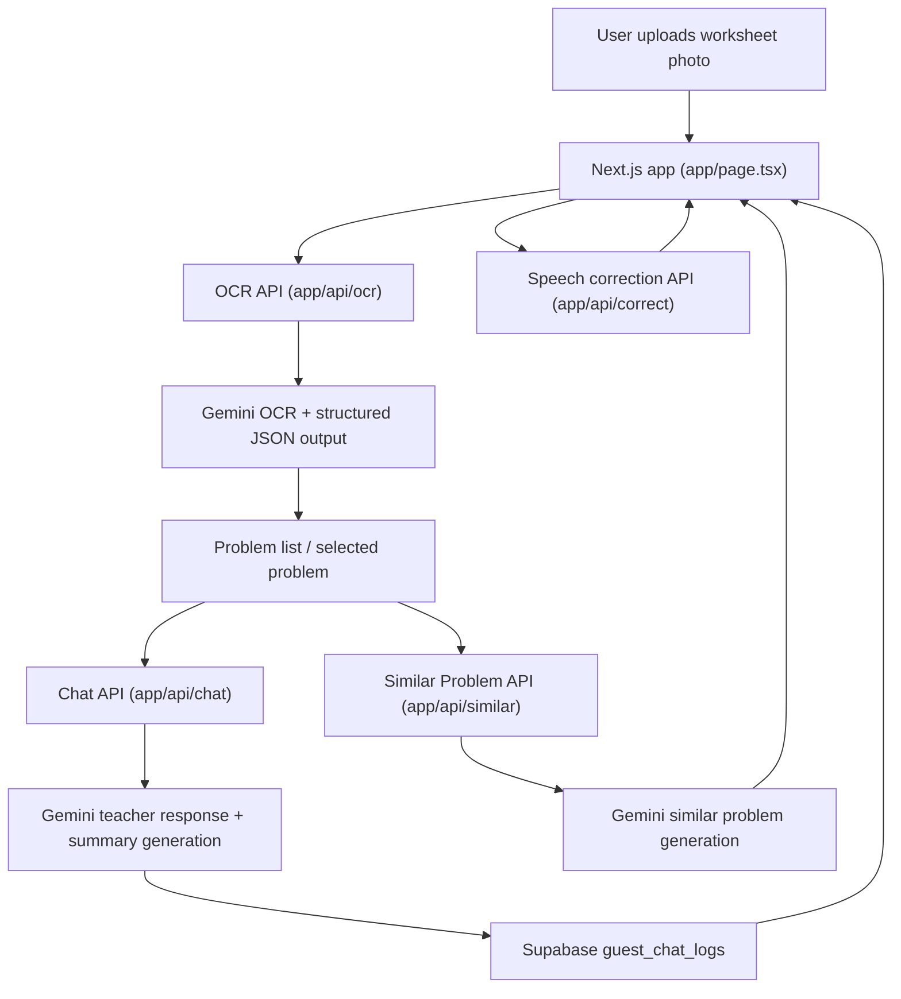

# WAKARUMADE

AI-powered math word problem tutor for elementary students.

OCR -> AI explanation -> Similar problems

Demo video: [https://youtu.be/4-p-3T3RSig](https://youtu.be/4-p-3T3RSig)

WAKARUMADE is a bilingual web app that helps Grades 1-3 learners work through math word problems step by step. A child can upload a worksheet photo, let the app extract each problem with OCR, chat with an AI teacher for guided support, and generate a similar follow-up problem for extra practice.

This repository is a strong code sample because it shows product thinking as well as implementation detail: OCR ingestion, structured AI responses, session persistence, and a conversational interface built for a real learner workflow.

## What It Solves

Many children struggle with math word problems not because they cannot calculate, but because they cannot map the story into the right operation. WAKARUMADE focuses on that reasoning gap by turning each worksheet problem into a guided conversation.

The current app supports:

- OCR-based extraction of multiple problems from a worksheet image
- Japanese and English learning flows
- Chat-based AI guidance for each selected problem
- Voice input with correction for spoken text
- Similar problem generation after a learner completes a problem
- Guest session persistence per problem using Supabase
- Automatic restoration of the latest saved conversation

## Tech Stack

- Next.js 15.5.7
- React 19.2.1
- TypeScript 5.8
- Supabase JavaScript client 2.84.0
- Google GenAI SDK 1.28.0
- Prisma 5.22.0 (present in the repo for local schema/migration work)
- Tailwind CSS 3.3

## Architecture Notes



- High-level flow: photo upload -> OCR extraction -> problem selection -> tutoring chat -> Supabase persistence -> similar problem generation
- The browser handles learner interaction and session restore, while server routes call Gemini and persist logs in Supabase.

- `app/page.tsx` coordinates the main learner flow and delegates UI sections to smaller components.
- `app/api/ocr/route.ts` sends worksheet images to Gemini and requests structured JSON output.
- `app/api/chat/route.ts` manages the tutoring conversation, keeps the exchange in Supabase, and generates a short learning summary.
- `app/api/similar/route.ts` creates a new related problem from the original question and session summary.
- `app/api/correct/route.ts` cleans up speech-to-text input for elementary math usage.
- Supabase is the active persistence layer in the current tutoring flow; Prisma files remain in the repository but are not the primary runtime path for chat storage.
- `components/app/` contains the main UI sections used by the page.
- `lib/` contains reusable helpers and localized text resources.
- `types/` contains shared application types.

## Security Note

`GEMINI_API_KEY` is intentionally read only from server-side environment variables. It should not be exposed through `next.config.js` or any `NEXT_PUBLIC_*` variable.

## Local Setup

### Requirements

- Node.js 20 or newer
- A Google Gemini API key
- A Supabase project with a `guest_chat_logs` table

### Environment Variables

Create `.env.local` in the project root with:

```env
GEMINI_API_KEY=your_gemini_api_key
NEXT_PUBLIC_SUPABASE_URL=your_supabase_project_url
NEXT_PUBLIC_SUPABASE_ANON_KEY=your_supabase_anon_key
SUPABASE_URL=your_supabase_project_url
SUPABASE_SERVICE_ROLE_KEY=your_supabase_service_role_key

# Optional: disable Supabase read/write (no persistence or restore)
# DISABLE_SUPABASE=true
# NEXT_PUBLIC_DISABLE_SUPABASE=true
```

The browser uses the `NEXT_PUBLIC_*` values for restoring guest sessions, and the server routes use `SUPABASE_URL` plus `SUPABASE_SERVICE_ROLE_KEY` to read and write tutoring logs safely.

### Supabase Table

Create this table in Supabase:

```sql
CREATE TABLE guest_chat_logs (
  guest_id TEXT NOT NULL,
  problem_id TEXT NOT NULL,
  log JSONB NOT NULL,
  summary TEXT,
  created_at TIMESTAMP WITH TIME ZONE DEFAULT NOW(),
  updated_at TIMESTAMP WITH TIME ZONE DEFAULT NOW(),
  PRIMARY KEY (guest_id, problem_id)
);
```

### Run Locally

```bash
npm install
npm run dev
```

Then open [http://localhost:3000](http://localhost:3000).

## Repository Structure

```text
app/
  api/
    chat/
    correct/
    hint/
    ocr/
    parse/
    similar/
  globals.css
  layout.tsx
  page.tsx
components/
  app/
lib/
prisma/
public/
types/
prompts.ts
next.config.js
package.json
```

## Current Scope vs Future Work

Implemented now:

- OCR ingestion from worksheet photos
- AI tutoring chat per problem
- Similar problem generation
- Voice input correction
- Guest conversation persistence and restoration
- Bilingual UI copy

Possible next improvements:

- Parent or teacher dashboard for reviewing struggle patterns
- Stronger analytics around repeated misconception types
- Better learner profiles beyond guest sessions
- More deliberate test coverage around API routes and flow state

## License

MIT. See [LICENSE](LICENSE).
